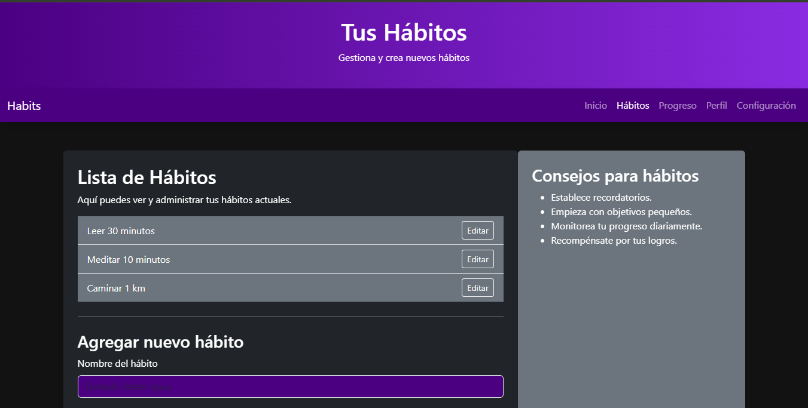

# 🌟 Habits – Tu Asistente de Hábitos Personales

**Habits** es una aplicación web diseñada para ayudarte a construir y mantener hábitos diarios de forma sencilla, visual y motivadora. Ya sea que quieras leer más, beber agua, hacer ejercicio o aprender algo nuevo, *Habits* te da las herramientas para mantener el rumbo.

---

## 📌 Características

- 🧠 Seguimiento de hábitos diarios y semanales
- 📊 Vista de progreso con estadísticas visuales
- 🎯 Sección de metas personales
- 🧾 Perfil de usuario editable
- ⚙️ Configuración personal (modo oscuro, preferencias, etc.)
- 💜 Diseño moderno con Bootstrap y tema oscuro degradado

---

## 🖼️ Captura de pantalla

---

## 🚀 Tecnologías utilizadas

- HTML5, CSS3, JavaScript
- Bootstrap 5
- FontAwesome (iconos)